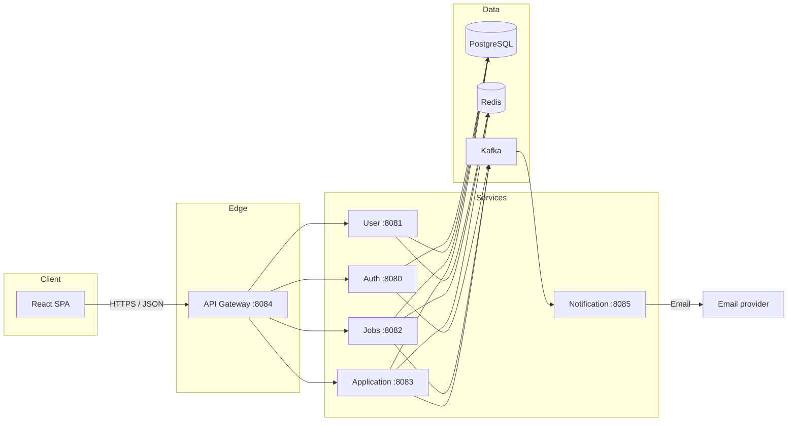
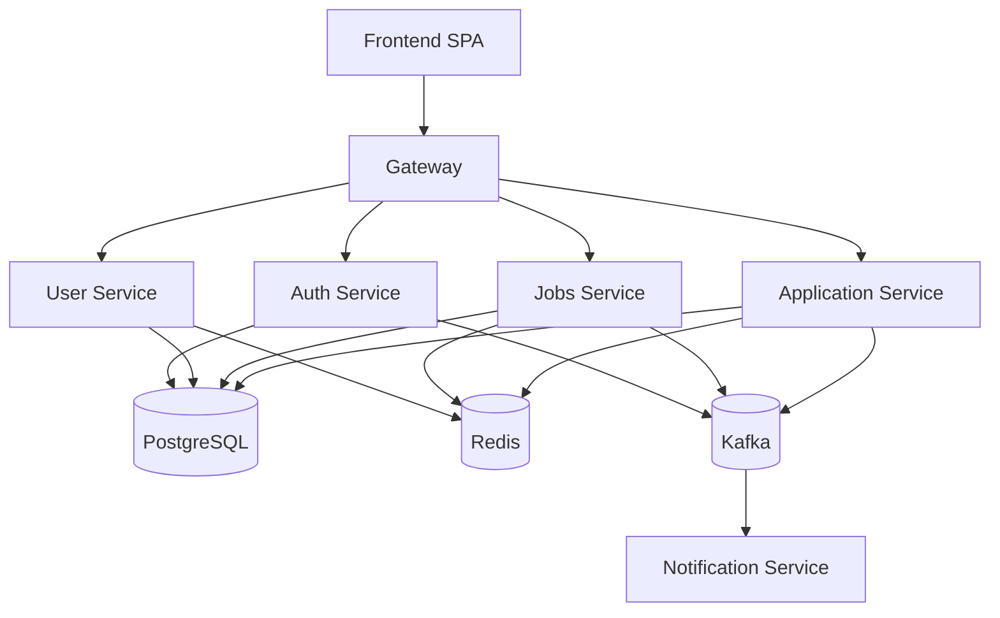

# Job Platform

A **microservices-based job board**: candidates discover roles and apply; recruiters post and manage listings and review applications. The **React** client talks only to an **API gateway**; backend capabilities are split into **auth**, **user profile**, **jobs**, **applications**, and **notifications**, backed by **PostgreSQL**, **Redis**, and **Kafka**.

---

## Problem

| Challenge | Why it matters |
|-----------|----------------|
| **Scaling and isolation** | A single monolith mixes authentication, listings, applications, and notifications. Heavy read traffic on jobs or spikes in applications can slow login and profile APIs. |
| **Clear boundaries** | Recruiters and job seekers have different permissions and workflows. Auth, domain data, and async side effects (email) should not be tangled in one deployable unit. |
| **Consistency vs. responsiveness** | Listing jobs and applying should stay fast; sending email confirmations can happen asynchronously without blocking HTTP responses. |
| **Operational clarity** | Teams need a single public entry point (gateway), traceable APIs, and infrastructure that matches real-world patterns (cache, message bus, relational data). |

---

## Solution

This project addresses those concerns by:

1. **API gateway** — One URL for clients. Validates **JWTs** on protected routes, then **reverse-proxies** to the correct service. Optional **Helmet**, **CORS**, and **rate limiting** on the gateway.
2. **Service boundaries** — **Auth** owns credentials and tokens; **user** owns extended profile data linked to `auth_id`; **jobs** owns postings; **application** owns apply flows and status updates. Each service can scale or evolve independently.
3. **Caching** — **Redis** is used in jobs, user, and application services to cache list/search/profile/application reads and reduce database load.
4. **Event-driven notifications** — **Kafka** topics (`user.created`, `job.created`, `application.created`) decouple producers from the **notification** service, which consumes events and triggers **email** workflows without blocking core APIs.
5. **Role-based access** — **Recruiter**-only actions (create/update/delete jobs, update application status) are enforced in the services with middleware, while **JWT** carries `role` from auth.

---

## Architecture

### High-level diagram



### Request flow (typical)

1. Browser calls **`{GATEWAY}/auth/login`** or attaches **`Authorization: Bearer <jwt>`** for protected routes.
2. Gateway **`verifyToken`** runs on `/users`, `/jobs`, and `/applications` (not on `/auth` except where the auth service itself requires a token).
3. Request is proxied to the target service; path prefixes are rewritten to each service’s **`/api/v1/...`** base path.
4. Services read/write **Postgres**, use **Redis** where implemented, and **publish Kafka events** where relevant.

### Event flow (Kafka)

| Topic | Produced by | Consumed by | Purpose |
|-------|-------------|-------------|---------|
| `user.created` | Auth (on register) | Notification | Welcome / onboarding email flows |
| `job.created` | Jobs (on create) | Notification | Notify subscribers or internal workflows |
| `application.created` | Application (on apply) | Notification | Acknowledgement / recruiter-side alerts |

The notification service is primarily a **Kafka consumer**; it exposes minimal HTTP (health) and is not routed through the gateway for business APIs.

---

## Current project status

### Implementation snapshot

| Area | Status | Notes |
|------|--------|-------|
| Frontend shell and auth flow | In progress | Home, register, login, profile setup, candidate dashboard pages are wired in the router. |
| Recruiter workflow UI | In progress | Post job and applicants pages are present in routes. |
| API gateway | Active | Reverse proxy, JWT verification on protected groups, Swagger docs endpoint. |
| Auth service | Active | Register/login/logout/profile, JWT issuance, role support (`user`/`recruiter`). |
| User service | Active | Profile CRUD by `auth_id`, Redis-backed read caching. |
| Jobs service | Active | List/search/get/create/update/delete jobs, recruiter-only write access, Redis caching. |
| Application service | Active | Apply/list/filter/status update, recruiter-only status mutation, Redis caching. |
| Notification service | Active | Kafka consumer for `user.created`, `job.created`, `application.created` events; email dispatch integration. |
| Infra (Docker Compose) | Active | Postgres, Redis, Zookeeper, Kafka, all backend services and gateway included. |

### Architecture status view



---

## Tech stack

### Frontend (`frontend/`)

| Layer | Technology |
|-------|------------|
| UI | React 18 |
| Build / dev | Vite 8 |
| Styling | Tailwind CSS 4 (`@tailwindcss/vite`) |
| Routing | React Router 7 |
| HTTP | Axios |
| Animation / icons | GSAP, Lucide React |

### Backend (per service)

| Concern | Technology |
|---------|------------|
| Runtime | Node.js (ES modules) |
| HTTP | Express 5 |
| Gateway proxy | `http-proxy-middleware` |
| Security | `helmet`, `cors`, `express-rate-limit`, `jsonwebtoken` |
| API docs | `swagger-jsdoc`, `swagger-ui-express` (served by gateway) |
| Password hashing | `bcrypt` (auth service) |

### Data & infrastructure

| Component | Technology | Role |
|-----------|------------|------|
| Primary database | PostgreSQL 15 | Users, auth, jobs, applications |
| Cache | Redis 7 | Response caching for jobs, users, applications |
| Message broker | Kafka 7.4 (Confluent image) | Async domain events |
| Coordination | Zookeeper | Kafka dependency in Compose |

### Operations

| Tool | Role |
|------|------|
| Docker & Docker Compose | Local full stack (`backend/docker-compose.yml`) |

---

## Repository layout

| Path | Responsibility |
|------|----------------|
| `frontend/` | SPA: landing, login, register; uses `VITE_BACKEND_URL` → gateway |
| `backend/gateway/` | JWT verification, proxy to services, Swagger UI at `/api-docs` |
| `backend/services/auth/` | Register, login, logout, profile; issues JWT; publishes `user.created` |
| `backend/services/user/` | Profile CRUD keyed by `auth_id`; Redis caching |
| `backend/services/jobs/` | Job CRUD, pagination, search; Redis caching; publishes `job.created` |
| `backend/services/application/` | Apply, list/filter applications, status updates; Redis caching; publishes `application.created` |
| `backend/services/notification/` | Consumes Kafka; sends email via configured provider |
| `backend/docker-compose.yml` | Postgres, Redis, Zookeeper, Kafka, all services |

Reference SQL for schemas: `backend/services/*/src/sql/` (apply to Postgres when bootstrapping or migrating).

---

## API reference (via gateway)

**Base URL (local):** `http://localhost:8084`  

Unless noted, send JSON with `Content-Type: application/json`.  

**Protected routes** require: `Authorization: Bearer <access_token>`.

### Auth (`/auth` → auth service `/api/v1/auth`)

| Method | Path | Auth | Purpose |
|--------|------|------|---------|
| `POST` | `/auth/register` | Public | Create account. Body: `username`, `email`, `password`, `role` (`user` \| `recruiter`). Returns JWT + user. Publishes `user.created`. |
| `POST` | `/auth/login` | Public | Body: `email`, `password`. Returns JWT + user. |
| `POST` | `/auth/logout` | Bearer | Logout (stateless token invalidation is not centralized; client discards token). |
| `GET` | `/auth/profile` | Bearer | Profile derived from token. |

### Users (`/users` → user service `/api/v1/user`)

Gateway requires **Bearer** for all routes below.

| Method | Path | Purpose |
|--------|------|---------|
| `POST` | `/users` | Create profile. Body includes `auth_id`, `phone`, `role`, `skills`, `resume_url` (see user model). |
| `GET` | `/users/:auth_id` | Get profile by auth user id (cached in Redis). |
| `PUT` | `/users/:auth_id` | Partial update: `phone`, `role`, `skills`, `resume_url`. |
| `DELETE` | `/users/:auth_id` | Delete profile. |

### Jobs (`/jobs` → jobs service `/api/v1/jobs`)

Gateway requires **Bearer** for **all** job routes (including listing and search).

| Method | Path | Role / notes | Purpose |
|--------|------|--------------|---------|
| `GET` | `/jobs` | Any authenticated user | Paginated list. Query: `page` (default 1), 10 items per page. Cached. |
| `GET` | `/jobs/search` | Any authenticated user | Search by query param **`keyword`** (and optional `page`). Cached. |
| `GET` | `/jobs/:id` | Any authenticated user | Job by id. |
| `POST` | `/jobs` | **Recruiter** | Create job. Body: `title`, `description`, `company`, `location`, `salary_min`, `salary_max`, `job_type`, `experience_level`, `skills`. Publishes `job.created`. |
| `PUT` | `/jobs/:id` | **Recruiter** | Update job. |
| `DELETE` | `/jobs/:id` | **Recruiter** | Delete job. |

### Applications (`/applications` → application service `/api/v1/applications`)

Gateway requires **Bearer** for all routes below. Recruiter-only routes are enforced in the application service.

| Method | Path | Role / notes | Purpose |
|--------|------|--------------|---------|
| `POST` | `/applications/apply` | Applicant (authenticated) | Body: `jobId`, `resumeUrl`. Creates application; publishes `application.created`. |
| `GET` | `/applications` | Authenticated | List applications. **Query:** exactly one of `userId` or `jobId` (required by controller). Cached. |
| `GET` | `/applications/job/:jobId` | Authenticated | Applications for a job. |
| `GET` | `/applications/user/:userId` | Authenticated | Applications for a user. |
| `PUT` | `/applications/:applicationId/status` | **Recruiter** | Body: `status`. Updates pipeline status. |

### Interactive documentation

- **Swagger UI:** `GET http://localhost:8084/api-docs` (OpenAPI served by the gateway; reflects documented paths under `/auth`, `/users`, `/jobs`, `/applications`).

---

## Cross-cutting behavior

| Topic | Behavior |
|-------|----------|
| **JWT** | Issued by auth on register/login. Gateway validates on `/users`, `/jobs`, `/applications`. Payload includes `id`, `email`, `role`. |
| **Roles** | `user` and `recruiter`. Recruiter-only routes use service-level `roleMiddleware`. |
| **Rate limiting** | Auth routes use service-level rate limiters; gateway also configures Express rate limiting (see `backend/gateway/src/server.js`). |
| **Caching** | Jobs (list/search), user profiles, and application lists use Redis with TTLs where implemented. |

---

## Service ports (local defaults)

| Port | Service |
|------|---------|
| 8080 | Auth |
| 8081 | User |
| 8082 | Jobs |
| 8083 | Application |
| **8084** | **API Gateway** (public API base for the SPA) |
| 8085 | Notification (HTTP health; main work is Kafka consumption) |
| 5432 | PostgreSQL (`jobdb` in Compose) |
| 6379 | Redis |
| 9092 | Kafka |
| 2181 | Zookeeper |

---

## Prerequisites

- **Node.js 18+** (frontend local dev; optional per-service local runs)
- **Docker** and **Docker Compose** (recommended backend stack)

---

## Run the backend (Docker)

```bash
cd backend
```

Provide env files referenced in `docker-compose.yml` (e.g. `services/auth/.env`, `services/user/.env`, `services/jobs/.env`, `services/application/.env`, `gateway/.env`). Auth needs at least **`DATABASE_URL`**, **`JWT_SECRET`**, **`PORT`** — see `backend/services/auth/env.example`.

```bash
docker compose up --build
```

---

## Run the frontend

```bash
cd frontend
npm install
npm run dev
```

Vite defaults to port **5173**. Configure the gateway URL if needed:

```env
# frontend/.env
VITE_BACKEND_URL=http://localhost:8084
```

If unset, the app defaults to `http://localhost:8084` (see `frontend/src/context/AuthContext.jsx`).

---

## Frontend routes (current)

| Route | Page |
|-------|------|
| `/` | Home / landing |
| `/login` | Login |
| `/register` | Register |
| `/setup` | User profile setup |
| `/dashboard` | User dashboard |
| `/applications` | My applications |
| `/jobs` | Browse jobs |
| `/post-job` | Recruiter: post job |
| `/applicants` | Recruiter: applicants view |

---

## Scripts

| Location | Command | Purpose |
|----------|---------|---------|
| `frontend/` | `npm run dev` | Vite dev server |
| `frontend/` | `npm run build` | Production build |
| `frontend/` | `npm run preview` | Preview production build |
| `frontend/` | `npm run lint` | ESLint |

Backend services are normally run via **Docker Compose**; each service folder has its own `package.json` for local debugging.

---

## Summary

| Area | What this project provides |
|------|----------------------------|
| **Problem** | Scalable, separated concerns for a job board with recruiters and applicants |
| **Solution** | Gateway + microservices + Postgres + Redis + Kafka + notification consumer |
| **APIs** | REST through **`http://localhost:8084`**: auth, users, jobs, applications (see tables above) |
| **Architecture** | Client → Gateway → Services → DB/Redis/Kafka; notifications via Kafka |
| **Tech stack** | React/Vite/Tailwind, Express 5, PostgreSQL, Redis, Kafka, Docker |

For request/response shapes and schemas, use **Swagger** at `/api-docs` on the gateway while it is running.
